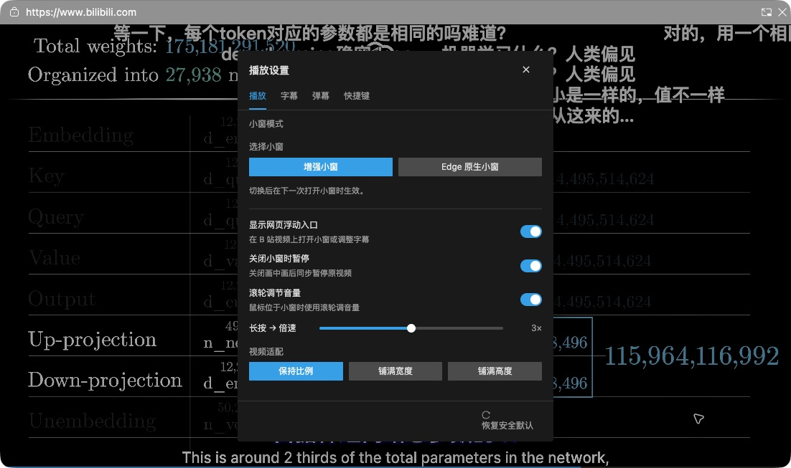
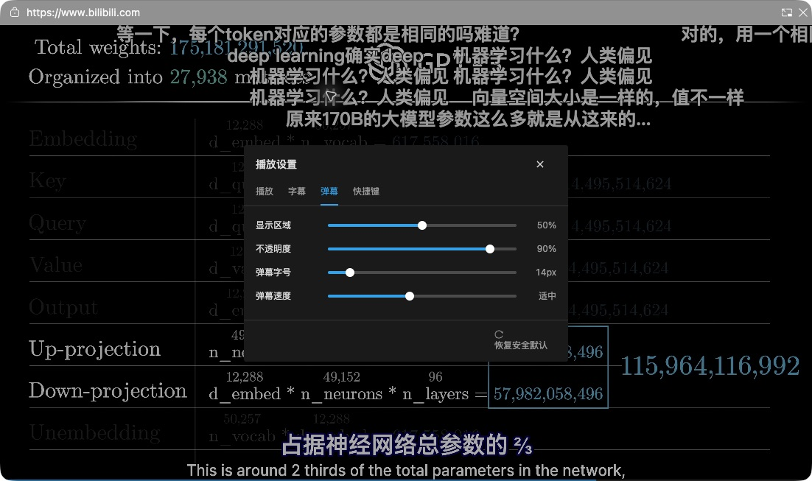
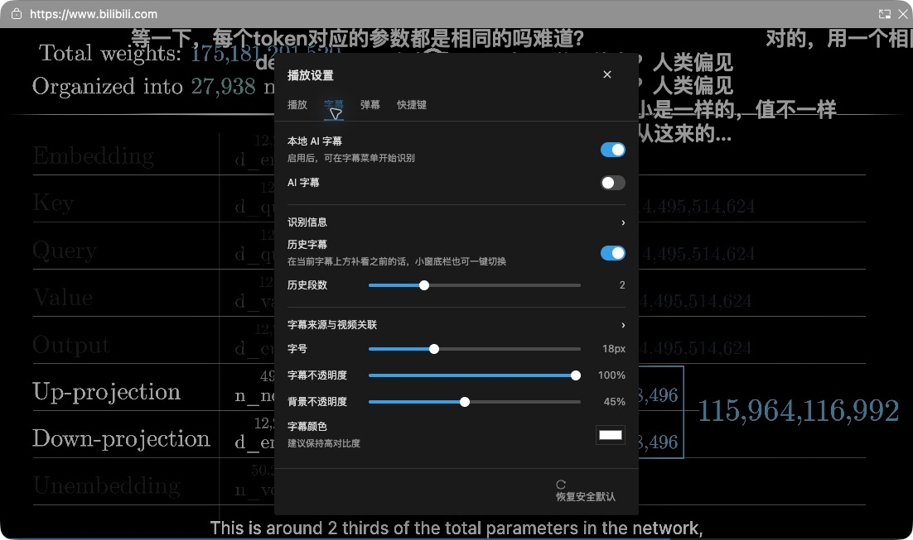

# 叠映 LayerPiP 使用教程

适用于 **0.2.22 内测版**，以桌面版 Edge 和 B 站视频为主要使用场景。

[安装与更新](#安装与更新) · [打开小窗](#打开小窗) · [播放操作](#播放操作) · [弹幕](#弹幕) · [字幕](#字幕) · [本地-ai-字幕](#本地-ai-字幕) · [双画面](#双画面) · [常见问题](#常见问题)

## 安装与更新

### 第一次安装

1. 获取维护者提供的内测扩展文件夹；如果拿到压缩包，先解压。
2. 将文件夹放在一个准备长期保留的位置。安装后不要随意移动或删除它。
3. 在 Edge 地址栏输入 `edge://extensions`。
4. 打开“开发人员模式”，点击“加载解压缩的扩展”。
5. 选择直接包含 `manifest.json` 的那一层文件夹。如果使用本项目的本地交付，选择 `dist`。
6. 确认扩展列表中出现 **叠映 LayerPiP**。可以将扩展图标固定到工具栏，方便日后打开。

仓库当前只有源码，没有正式版安装包。GitHub 的 **Code → Download ZIP** 不是可直接安装的扩展包。普通使用者无需运行命令或自行构建，请使用维护者提供的内测包。

如果同时装有旧版 FloatCaption 或其他会接管同一视频的小窗插件，先停用它们，避免重复开窗或控制冲突。

### 更新已有版本

1. 关闭当前小窗。
2. 按维护者提供的更新说明，将新版放到原来加载扩展的位置；先保留旧文件作为备份。
3. 回到 `edge://extensions`，点击 LayerPiP 的“重新加载”。
4. **刷新已经打开的 B 站页面**，然后重新打开小窗。

只重新加载扩展、没有刷新视频页面时，页面可能仍使用旧界面。更新不需要先卸载扩展；卸载可能使已有设置丢失。

## 打开小窗

1. 打开想看的 B 站视频，先在网页上点击一次播放器。
2. 点击浏览器工具栏中的 LayerPiP 图标，再点击 **打开小窗**。
3. 也可以将鼠标移到视频上，使用出现的浮动入口。
4. 拖动小窗到合适的位置，用窗口边缘调整大小。

保留原视频标签页。需要返回网页时，使用小窗标题栏的“返回到标签页”；结束观看时关闭小窗。

### 选择小窗模式

打开扩展中的 **设置**，或在增强小窗中选择 **齿轮 → 更多播放设置 → 播放**。

| 模式 | 适合的情况 |
| --- | --- |
| 增强小窗 | 需要完整播放控件、字幕和弹幕设置，或想使用双画面 |
| Edge 原生小窗 | 希望使用浏览器提供的简洁小窗 |

切换模式后，关闭并重新打开小窗，才会使用新模式。下文的齿轮菜单、完整设置和双画面操作均以增强小窗为例。

*本文配图来自实际运行中的插件界面，用于说明设置位置；不同内测版本的选项可能略有差异。截图中的视频内容来自 B 站 3Blue1Brown《直观解释大语言模型如何储存事实》，不属于本项目素材。*

## 播放操作

将鼠标移入小窗即可显示控制栏；离开后控制栏会自动隐藏。

- **播放和暂停**：点击左下角播放按钮。
- **调整进度**：点击进度条跳转，或拖动滑块定位。
- **调整音量**：使用音量按钮和滑条；也可以在播放设置里开启滚轮调节音量。
- **改变倍速**：点击控制栏的速度按钮，选择合适的速度。
- **使用快捷键**：在 **齿轮 → 快捷键** 查看当前操作提示；也可以在完整设置的 **快捷键** 页面查看常用按键。
- **窗口关闭后的行为**：在播放设置里选择是否“关闭小窗时暂停”。

使用快捷键前，先点击一次要控制的画面。正在输入文字或调整设置时，快捷键可能不会作用于视频。

### 看懂进度条

主进度条表示当前播放到了哪里。上方的高能曲线表示弹幕较密集的片段；没有高能数据时，会显示较薄的区间条。

区间条或曲线上的蓝色表示已看过，灰白色表示未看。跳过的部分不会仅因为拖动经过就全部变成已看。当前播放位置与历史已看范围含义不同，回放或跳转时可能并不重合。

## 弹幕

在小窗控制栏使用 **弹幕** 按钮开关显示。要调整观看效果，可进入 **更多播放设置 → 弹幕**：

- **显示区域**：减少弹幕占用的画面范围。
- **不透明度**：降低它可以让弹幕不那么遮挡视频。
- **弹幕字号**：按小窗尺寸调整文字大小。
- **弹幕速度**：调整弹幕经过屏幕的快慢。

学习视频建议先缩小显示区域，再根据画面内容调整透明度。视频本身没有弹幕时，开启显示也不会产生弹幕。

## 字幕

### 使用视频自带字幕

1. 打开控制栏的 **字幕** 菜单。
2. 选择可用的字幕来源或轨道。
3. 如果列表里没有需要的字幕，进入 **更多播放设置 → 字幕 → 字幕来源与视频关联**。
4. 选择“当前视频官方字幕”，读取并选择字幕轨道，然后保存。

视频没有官方字幕时，可以使用下面的其他来源。

### 导入自己的字幕

在 **字幕来源与视频关联** 中，根据手里的内容选择：

| 你手里的内容 | 选择方式 |
| --- | --- |
| 电脑中的 `.srt` 或 `.ass` 文件 | 本地字幕文件，选择文件后保存 |
| 可以直接访问的字幕地址 | 网络字幕链接，填入地址后保存 |
| 另一条 B 站视频里的字幕 | B 站视频来源，解析视频后选择分 P 和字幕轨道 |
| 同一视频其他分 P 的字幕 | 选择“另一个 B 站视频”，填入当前视频链接，再选择对应分 P 和轨道 |

这些来源设置关联当前视频的当前分 P。切到其他视频或分 P 后，需要检查是否选中了正确的字幕。

如果字幕与声音不同步，使用来源设置里的字幕时间偏移，先做小幅调整，再观察效果。想停用当前分 P 的字幕，可以将来源设为“关闭”。

### 调整样式和历史字幕

在完整设置的 **字幕** 页面，可以调整字号、字幕不透明度、背景不透明度和颜色。

开启 **历史字幕** 后，会在当前字幕上方保留前面的内容；使用“历史段数”控制保留多少段。控制栏也有历史字幕入口。没有开启有效字幕时，这个入口会不可用。

## 本地 AI 字幕

这是试验功能，适合尝试观看没有现成字幕的视频。

1. 在完整设置的 **字幕** 页面开启 **本地 AI 字幕**。
2. 将视频设为正常的 **1 倍速**，开始播放。
3. 在字幕菜单中选择 **开始识别**，或使用设置里的 AI 字幕控制。
4. 等待初始化和第一段识别结果。建议同时开启历史字幕，便于跟看稍晚出现的内容。
5. 不再需要时选择停止识别，或关闭本地 AI 字幕。

内测包包含所需资源，无需额外安装软件或填写 API Key。音频识别在本机进行，输出原语言字幕，**不等于自动翻译**。

识别有延迟，可能听错或截断句子，也会增加电脑负载。跳转进度、切换视频、修改倍速或关闭小窗后，识别可能停止；回到 1 倍速播放后，可手动重新开始。不要把识别字幕当成准确原文。

## 双画面

这是试验功能，目前支持 **两路 B 站普通视频**，需要使用增强小窗。

1. 先打开第一路视频的增强小窗。
2. 在小窗中选择 **齿轮 → 多画面**。
3. 在“第二画面”输入框里粘贴完整 B 站视频链接或 BV 号，点击 **加载**。支持带分 P 的视频链接，暂不支持短链、直播和番剧链接。
4. 等待第二路加载。如提示需要手动播放，在对应画面里点击播放。
5. 点击其中一路的 **开启声音**，让它出声；另一视频会保持静音。再次点击可静音。
6. 点击或聚焦某一路，标题中的 **控制中** 表示扩展播放快捷键当前控制的画面。
7. 点击 **退出多画面**，返回原来的单路小窗。

宽窗左右排列，窄窗上下排列。两路分别控制播放和进度，切换控制画面不会暂停另一视频。默认两路静音，不会自动混播声音。

当前限制：

- 最多两路，暂不支持四路、拖动分隔线或保存布局。
- 第二路使用 B 站自己的字幕和弹幕，尚未接入插件的本地 AI 字幕。
- 系统媒体键仍以主路为主，不保证跟随“控制中”标记。
- 主网页切换视频时会退出多画面；原视频标签页需要保持打开。
- 第二路加载超时或离开指定视频时会被关闭，第一路保留，可以重新加载。

## 常见问题

### 点击打开小窗没有反应

先回到视频页面点击播放器，再尝试打开。检查 LayerPiP 是否启用，并暂时停用其他接管播放器的小窗扩展。更新过插件后，先重新加载扩展并刷新视频页面。

### 更新后看不到新功能

关闭旧小窗，在扩展管理页重新加载 LayerPiP，再刷新 B 站页面。双画面入口只出现在 B 站普通视频的增强小窗中。

### 没有字幕

先确认字幕按钮已开启并选中来源。检查当前视频和分 P 是否有官方字幕；没有时可导入自己的字幕或尝试本地 AI。视频画面里自带的字幕属于画面内容，插件不能将其单独关闭。

### 弹幕遮住了内容

降低不透明度、缩小显示区域，或者临时关闭弹幕。无需关闭小窗。

### 高能曲线没有出现

并非每条视频都有高能数据；没有数据时仅显示已看区间。控制栏隐藏时，高能条也会隐藏。

### 第二路没有声音或停在封面

双画面默认静音。先在第二画面中点击播放，再点击“开启声音”；同时只保留一路声音。

### 设置改乱了

完整设置底部提供 **恢复安全默认**。它会重置相关选项；如果只是某一项不合适，优先只调整那一项。

### 怎样反馈问题

在[本仓库 Issues](https://github.com/SalmonC/LayerPiP/issues)附上版本号、从哪一步开始出问题、预期效果和实际效果。截图前隐藏个人信息；不需要提供 Cookie、账号密码或私人字幕文件。

[返回项目首页](../readme.md)
